# 02 — Wireframes

[◀ voltar ao índice](../README.md)

Wireframes de **todas as telas** do aplicativo, incluindo os 5 níveis do jogo. São 15 pranchas em SVG
(vetorial), cada uma com o desenho da tela, as cotas de medida e as anotações de comportamento.

---

## Convenções adotadas

Estes são **wireframes**, não telas finalizadas. Foram desenhados seguindo as convenções abaixo,
propositalmente:

| Convenção | Motivo |
| --- | --- |
| **Escala de cinza** | O wireframe define estrutura, hierarquia e comportamento. Cor é decisão da etapa seguinte — e, neste projeto, é o próprio usuário quem escolhe a paleta (WF-04). |
| **Um único acento azul** | Reservado exclusivamente para o que **não é interface**: cotas, marcadores numerados e notas. Nunca aparece dentro da tela desenhada. |
| **Hachuras no lugar de cor** | A resistência do tijolo (1, 2, 3 ou indestrutível) é distinguida por preenchimento e trama, não por cor. |
| **Cotas em dp** | A prancha usa 1 px = 1 dp, sobre um viewport de referência de 360 × 800 dp (1080 × 2400 px em xxhdpi). |
| **Marcadores numerados** | Cada elemento relevante recebe um número, explicado na coluna de anotações ao lado. |
| **Formato vetorial (SVG)** | Alta definição de fato: amplia sem perda para qualquer zoom ou impressão, e o arquivo é legível em diff no Git. |

**Como abrir:** as pranchas são exibidas direto no GitHub ao rolar esta página. Para ver em tamanho real,
clique na imagem ou abra o `.svg` em qualquer navegador.

---

## Mapa das telas

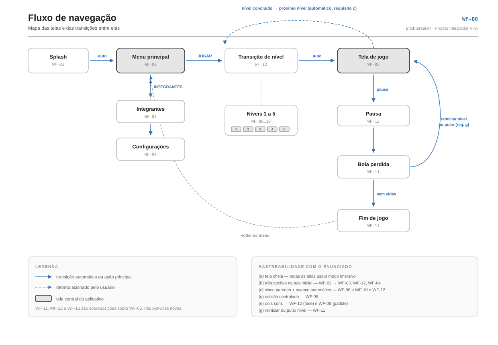

| Prancha | Tela | Tipo |
| --- | --- | --- |
| [WF-00](wireframes/00-fluxo-navegacao.svg) | Fluxo de navegação | diagrama |
| [WF-01](wireframes/01-splash.svg) | Splash / Abertura | Activity |
| [WF-02](wireframes/02-menu-principal.svg) | Menu principal | Activity |
| [WF-03](wireframes/03-integrantes.svg) | Integrantes do grupo | Activity |
| [WF-04](wireframes/04-configuracoes.svg) | Configurações | Activity |
| [WF-05](wireframes/05-tela-de-jogo.svg) | Tela de jogo — anatomia | Activity |
| [WF-06](wireframes/06-nivel-1.svg) | Nível 1 — Muralha | estado de WF-05 |
| [WF-07](wireframes/07-nivel-2.svg) | Nível 2 — Pirâmide | estado de WF-05 |
| [WF-08](wireframes/08-nivel-3.svg) | Nível 3 — Xadrez | estado de WF-05 |
| [WF-09](wireframes/09-nivel-4.svg) | Nível 4 — Campo minado | estado de WF-05 |
| [WF-10](wireframes/10-nivel-5.svg) | Nível 5 — Fortaleza | estado de WF-05 |
| [WF-11](wireframes/11-dialogo-bola-perdida.svg) | Diálogo — bola perdida | sobreposição |
| [WF-12](wireframes/12-transicao-de-nivel.svg) | Transição de nível | sobreposição |
| [WF-13](wireframes/13-pausa.svg) | Pausa | sobreposição |
| [WF-14](wireframes/14-fim-de-jogo.svg) | Fim de jogo / Vitória | Activity |

---

## Telas

### WF-01 · Splash

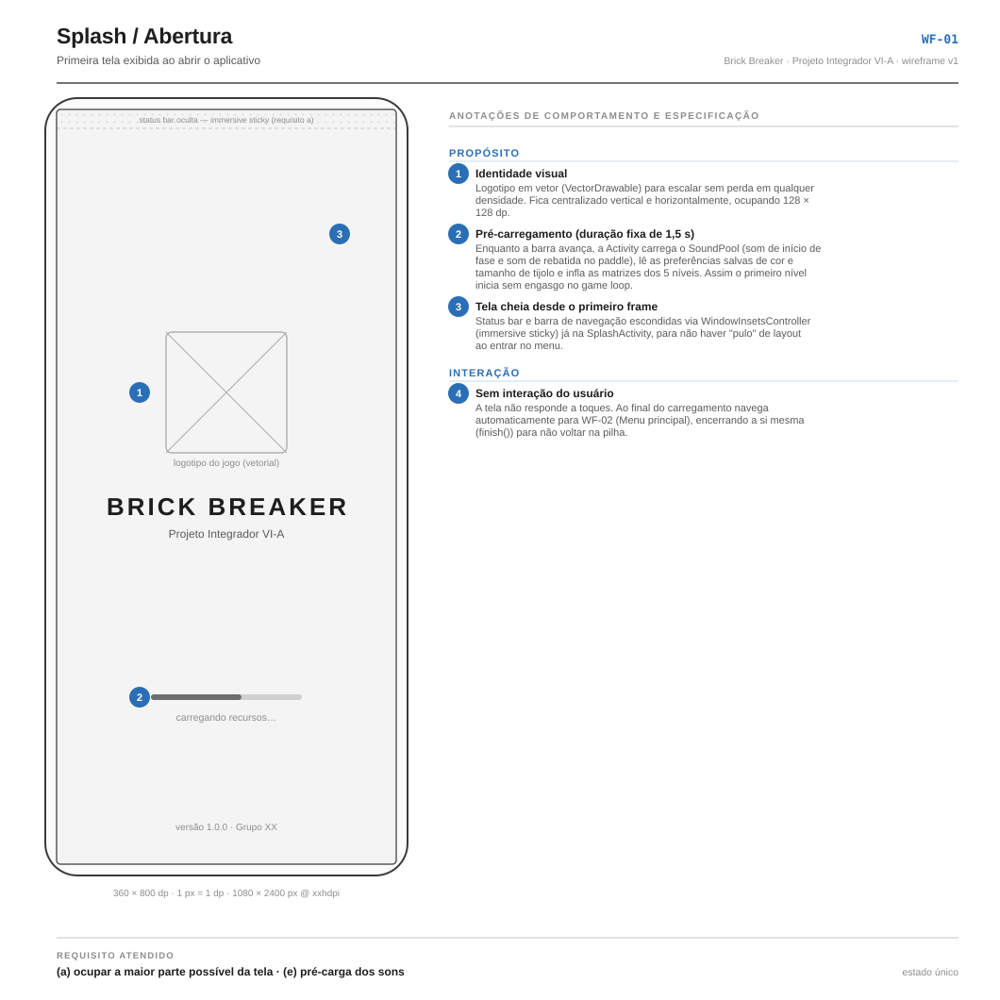

Tela de abertura com duração fixa de 1,5 s. Enquanto ela está visível, o aplicativo carrega o `SoundPool`,
lê as preferências salvas e monta as matrizes dos 5 níveis — assim o primeiro nível começa sem engasgo.
Já entra em modo imersivo, para não haver salto de layout ao abrir o menu.

---

### WF-02 · Menu principal — as três opções

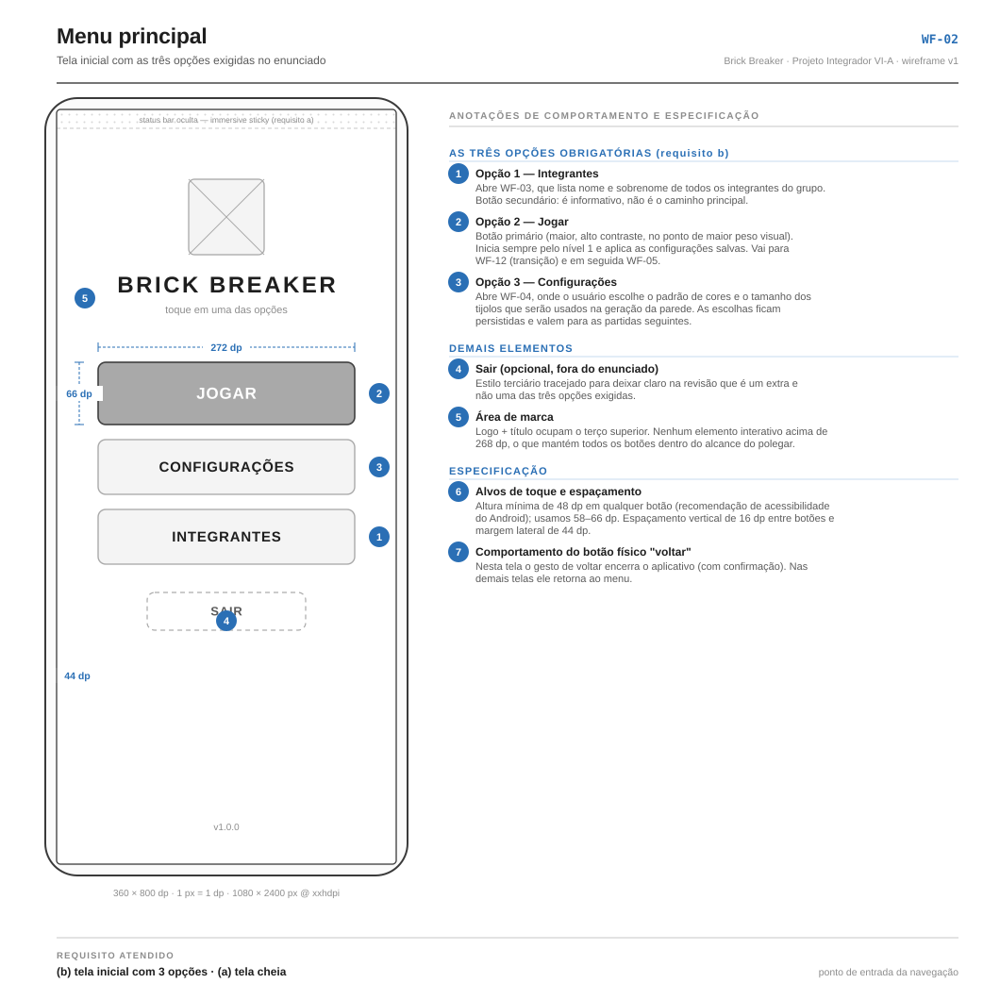

Atende diretamente ao **requisito (b)**:

| Opção do enunciado | Botão | Destino |
| --- | --- | --- |
| Opção 1 — nome e sobrenome dos integrantes | INTEGRANTES | WF-03 |
| Opção 2 — iniciar o jogo | **JOGAR** (primário) | WF-12 → WF-05 |
| Opção 3 — cores e tamanhos dos tijolos | CONFIGURAÇÕES | WF-04 |

A hierarquia visual não é decorativa: *Jogar* é a ação mais frequente, então recebe o maior peso, o maior
alvo de toque (66 dp) e a posição de leitura mais alta entre os três. Todos os botões ficam abaixo de
268 dp, dentro do alcance confortável do polegar.

---

### WF-03 · Integrantes

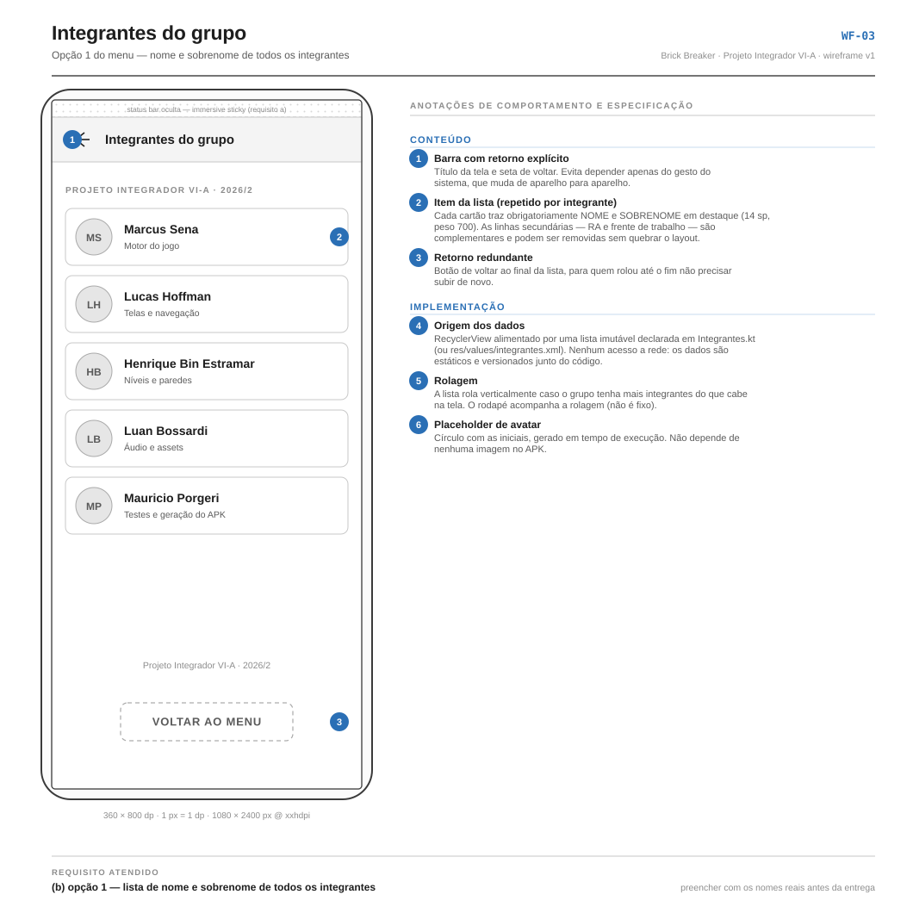

Lista de **nome e sobrenome de todos os integrantes**, alimentada por uma `RecyclerView` a partir de uma
lista estática no código. A frente de trabalho é informação complementar e pode ser retirada
sem quebrar o layout.

> ⚠️ Três sobrenomes ainda estão pendentes (Marcus, Henrique e Luan) — ver o aviso no [README](../README.md#integrantes-do-grupo).

---

### WF-04 · Configurações

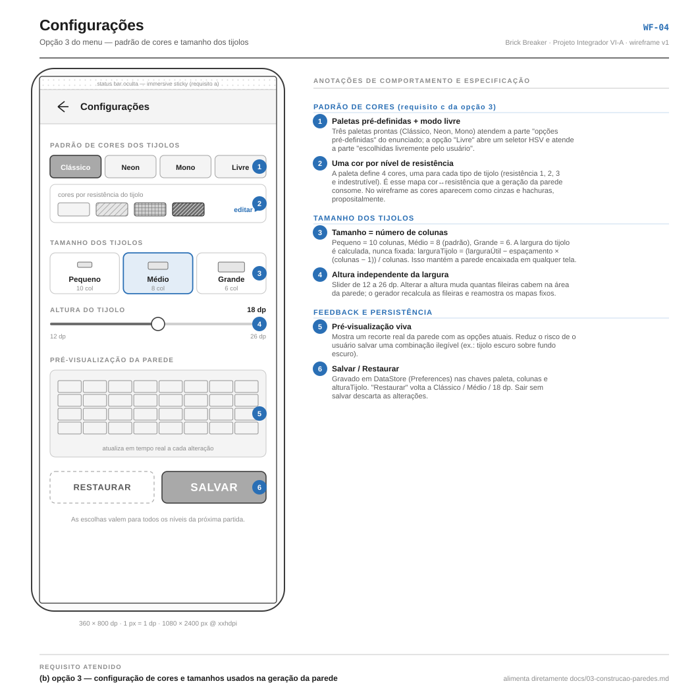

Atende à **opção 3 do requisito (b)** e alimenta a geração da parede descrita no
[documento 03](03-construcao-paredes.md).

**Padrão de cores.** Três paletas prontas — Clássico, Neon, Mono — cobrem a parte "opções pré-definidas"
do enunciado; a opção *Livre* abre um seletor HSV e cobre a parte "escolhidas livremente pelo usuário".
A paleta define uma cor por nível de resistência do tijolo.

**Tamanho dos tijolos.** O tamanho é expresso como número de colunas, que é o parâmetro que a geração da
parede realmente consome:

| Opção | Colunas | Largura resultante do tijolo (em 360 dp) |
| --- | --- | --- |
| Pequeno | 10 | ≈ 30,1 dp |
| **Médio** (padrão) | 8 | ≈ 38,4 dp |
| Grande | 6 | ≈ 52,2 dp |

A altura é independente e vai de 12 a 26 dp por um slider. A pré-visualização atualiza a cada mudança,
o que evita o usuário salvar uma combinação ilegível.

---

### WF-05 · Tela de jogo (anatomia)

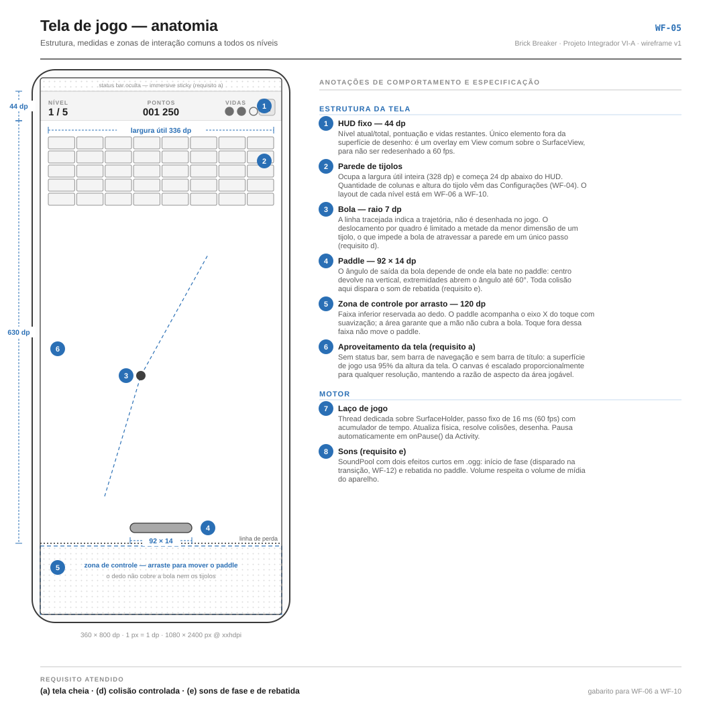

Esta prancha é o **gabarito** das telas de nível: define o HUD, a área da parede, as medidas do paddle e
da bola e as zonas de toque. WF-06 a WF-10 reaproveitam essa estrutura e mudam apenas a parede.

#### (a) — Aproveitamento da tela

O **requisito (a)** é atendido por três decisões combinadas:

1. Status bar e barra de navegação ocultas (`WindowInsetsControllerCompat`, modo *immersive sticky*);
2. Nenhuma barra de título ou `ActionBar`;
3. HUD de apenas 44 dp, desenhado como sobreposição em View comum — fora do `SurfaceView`, para não ser
   redesenhado 60 vezes por segundo.

Resultado: **630 dp de área jogável em 800 dp de tela**, com o restante ocupado pelo HUD e pela zona de
controle — que também é área útil, já que é onde o dedo fica.

#### Zona de controle

Os 120 dp inferiores são reservados ao arrasto do paddle. Essa faixa existe por um motivo prático: se o
paddle fosse controlado tocando diretamente sobre ele, a mão cobriria justamente a região onde a bola
chega. O paddle acompanha o eixo X do toque com suavização.

#### Sons — requisito (e)

| Som | Quando dispara | Prancha |
| --- | --- | --- |
| Início de fase | Primeiro quadro da transição de nível, inclusive no nível 1 e em todo reinício | WF-12 |
| Rebatida no paddle | Toda colisão da bola com a plataforma | WF-05 |

---

## Níveis do jogo

Cinco paredes, cinco métodos de construção diferentes — **requisito (c)**. Cada prancha traz a matriz do
nível em texto, os parâmetros do método e a contagem de tijolos. A lógica completa está no
[documento 03](03-construcao-paredes.md).

| Nível | Nome | Método | Tijolos | Acertos |
| --- | --- | --- | --- | --- |
| 1 | Muralha | Mapa fixo literal | 40 | 40 |
| 2 | Pirâmide | Meia matriz + espelhamento | 28 | 58 |
| 3 | Xadrez | Regra matemática sobre (linha, coluna) | 24 | 48 |
| 4 | Campo minado | Procedural com semente fixa | 32 | 50 |
| 5 | Fortaleza | Híbrido: moldura fixa + miolo procedural | 32 (+8 indestrutíveis) | 59 |

### WF-06 · Nível 1 — Muralha

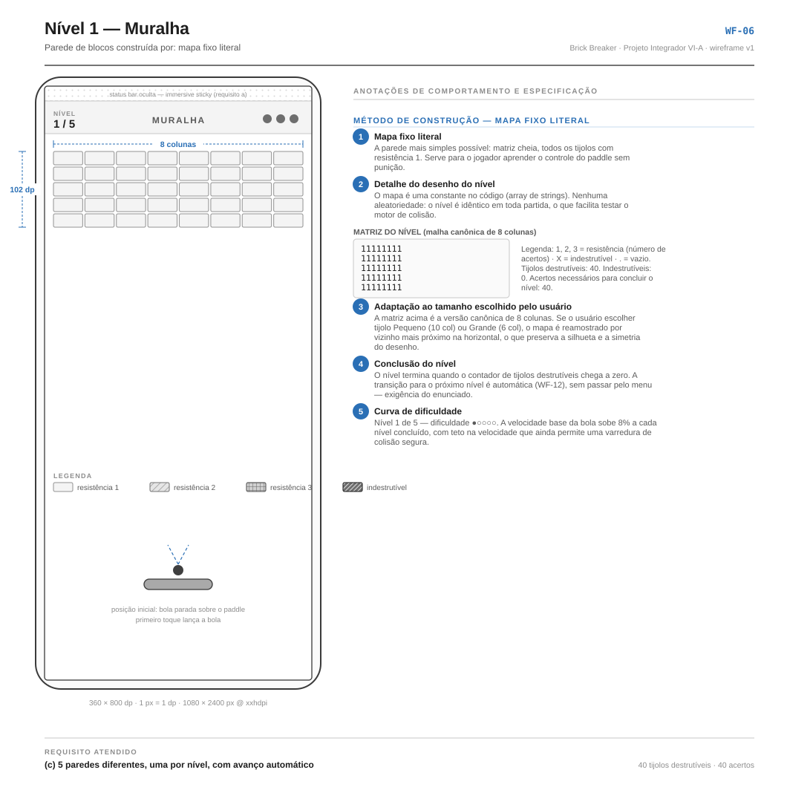

### WF-07 · Nível 2 — Pirâmide

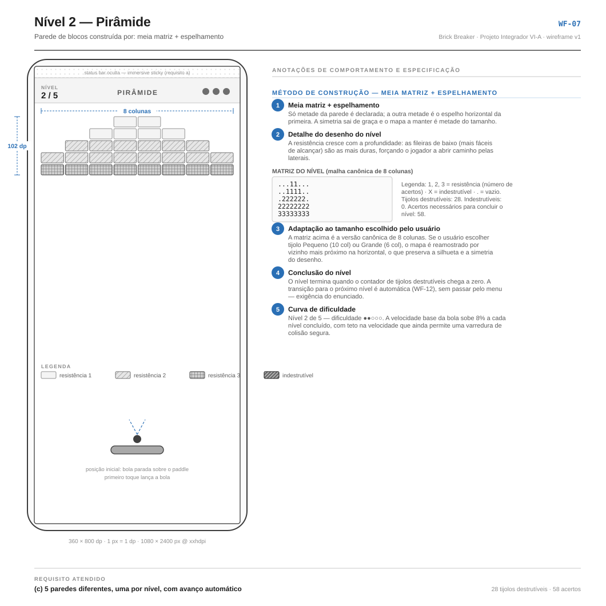

### WF-08 · Nível 3 — Xadrez

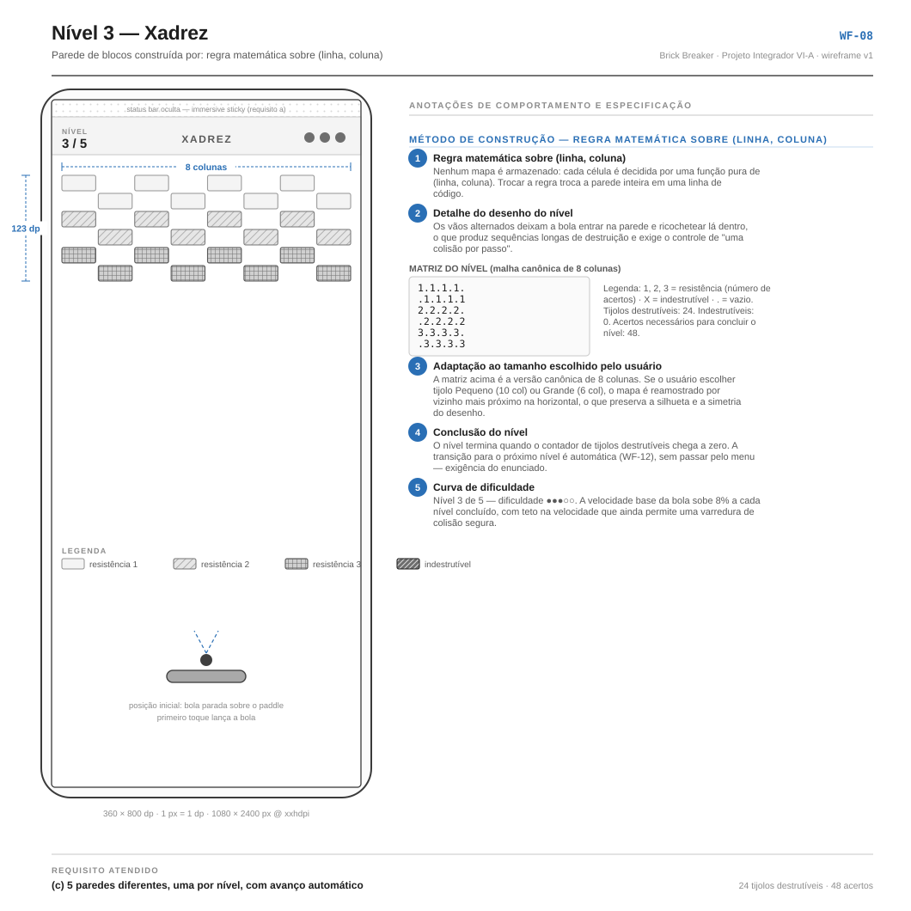

### WF-09 · Nível 4 — Campo minado

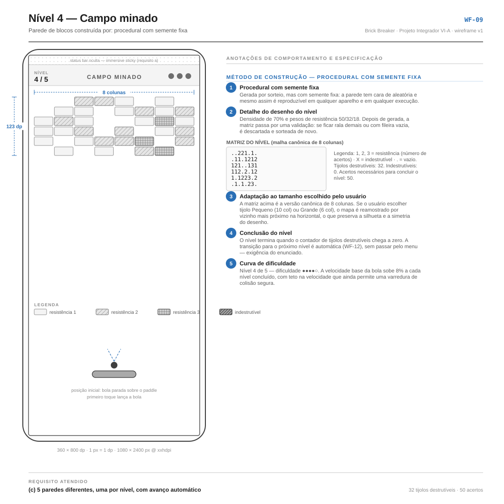

### WF-10 · Nível 5 — Fortaleza

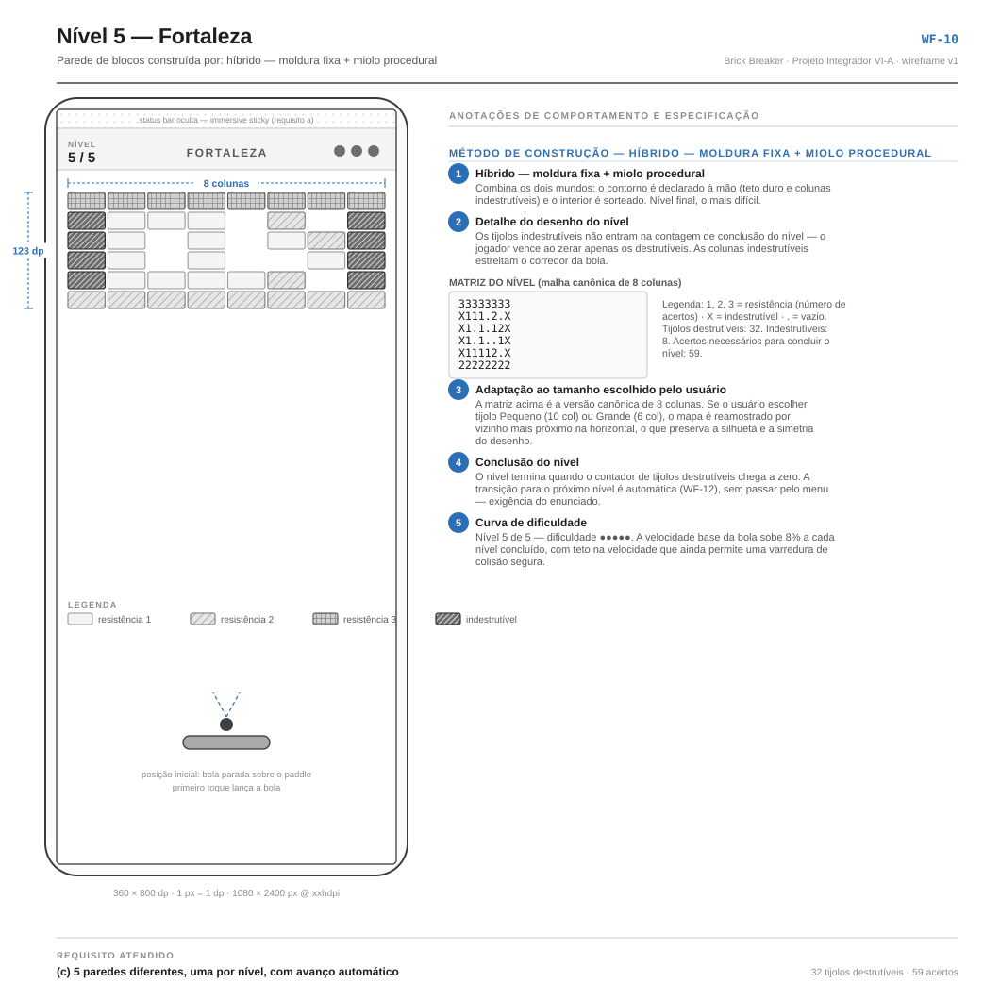

---

## Sobreposições

### WF-11 · Diálogo — bola perdida

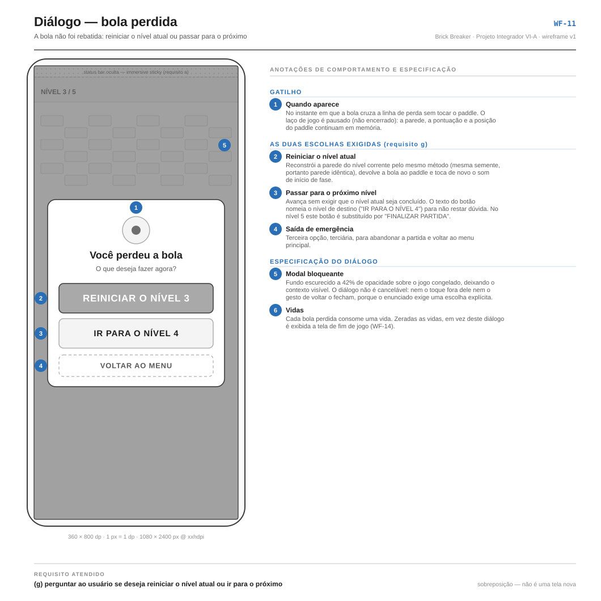

Atende ao **requisito (g)**. Aparece no instante em que a bola cruza a linha de perda sem tocar o paddle.
O laço de jogo é pausado, não encerrado: parede, pontuação e posição do paddle continuam em memória.

As duas opções exigidas pelo enunciado:

- **Reiniciar o nível atual** — reconstrói a parede pelo mesmo método e com a mesma semente, portanto
  idêntica à anterior, e devolve a bola ao paddle;
- **Ir para o próximo nível** — avança sem exigir a conclusão do nível atual. O rótulo nomeia o destino
  ("IR PARA O NÍVEL 4") para não restar dúvida; no nível 5 vira "FINALIZAR PARTIDA".

O diálogo é **bloqueante e não cancelável**: nem o toque fora dele nem o gesto de voltar o fecham, porque
o enunciado exige uma escolha explícita do usuário.

### WF-12 · Transição de nível

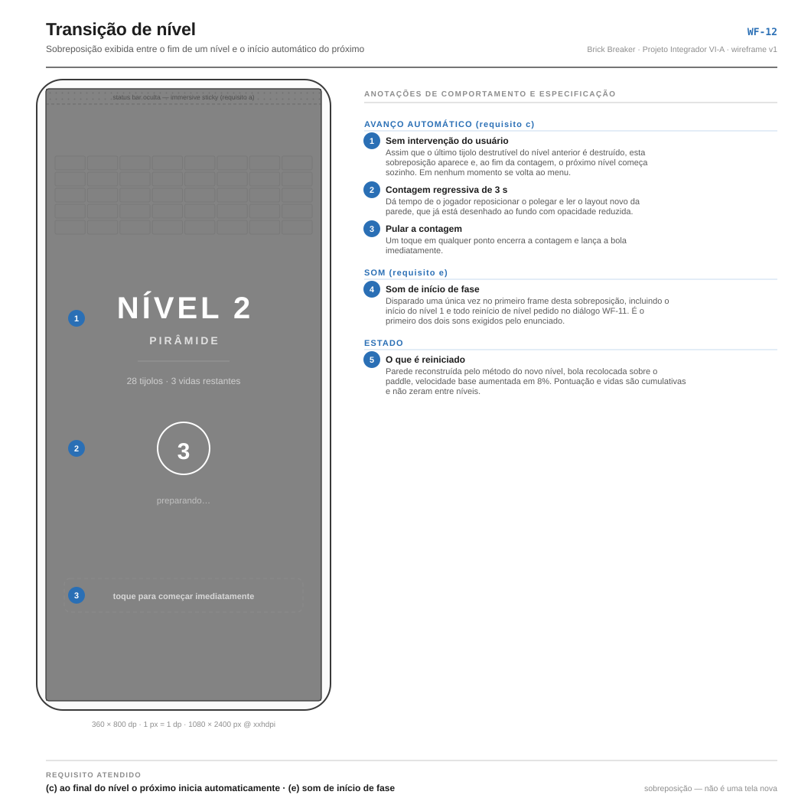

Atende à segunda parte do **requisito (c)** — *"ao final do nível deve iniciar o próximo automaticamente"*.
Destruído o último tijolo, esta sobreposição aparece, o som de início de fase toca e, após 3 segundos
(puláveis com um toque), o próximo nível começa sozinho. Em momento algum se volta ao menu.

A parede do novo nível já aparece esmaecida ao fundo, dando ao jogador tempo de ler o layout.

### WF-13 · Pausa

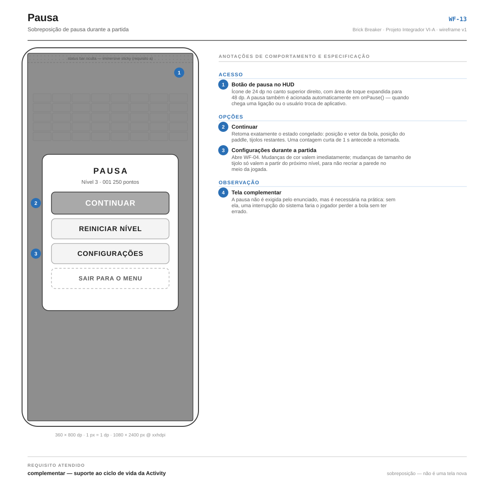

Não é exigida pelo enunciado, mas é necessária na prática: sem ela, uma ligação recebida faria o jogador
perder a bola sem ter errado. Acionada pelo botão do HUD ou automaticamente em `onPause()`.

### WF-14 · Fim de jogo / Vitória

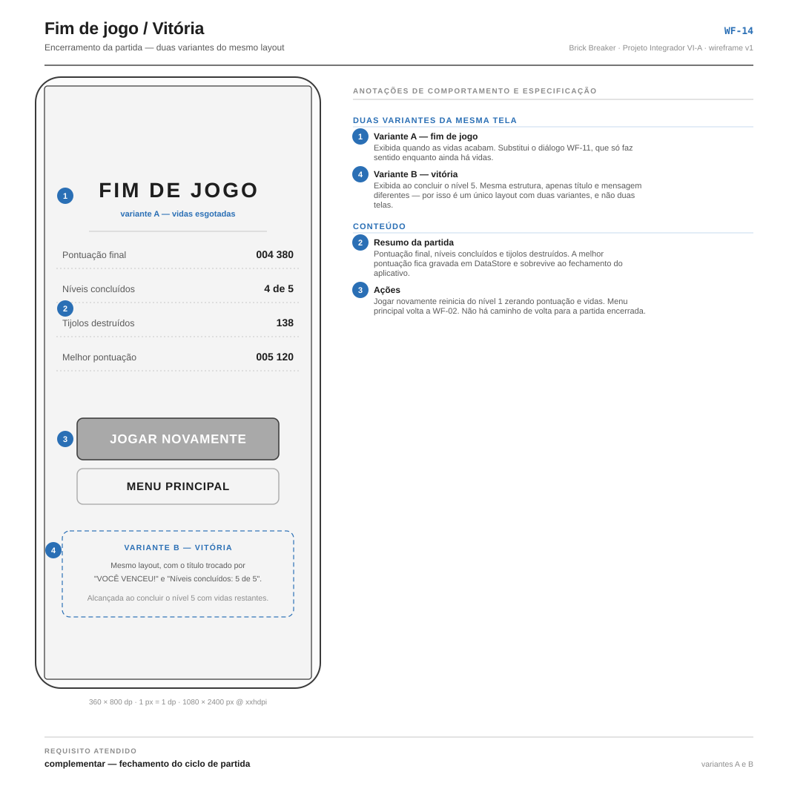

Um layout com duas variantes: **fim de jogo** (vidas esgotadas) e **vitória** (nível 5 concluído). Como só
mudam o título e a mensagem, são tratadas como variantes de uma mesma tela e não como duas telas.

---

## Rastreabilidade com o enunciado

| Requisito | Prancha(s) |
| --- | --- |
| (a) Ocupar a maior parte possível da tela | WF-01 a WF-14 (modo imersivo); detalhado em WF-05 |
| (b) Tela inicial com 3 opções | WF-02; destinos em WF-03, WF-04 e WF-12 |
| (c) 5 paredes diferentes + avanço automático | WF-06 a WF-10; avanço em WF-12 |
| (d) Controle de colisão da bola com os blocos | WF-05 (anotação 3) |
| (e) Som ao iniciar a fase e ao bater no paddle | WF-12 e WF-05 |
| (g) Reiniciar o nível ou passar para o próximo | WF-11 |

---

## Sobre a geração das pranchas

Os wireframes são **gerados por script** (`tools/gen-wireframes.mjs`), e não desenhados à mão em uma
ferramenta gráfica. A escolha tem uma razão concreta: as paredes desenhadas nas pranchas WF-06 a WF-10
saem exatamente do mesmo código que está documentado no
[documento 03](03-construcao-paredes.md). Wireframe e documentação não têm como divergir.

```bash
node tools/gen-wireframes.mjs
```
